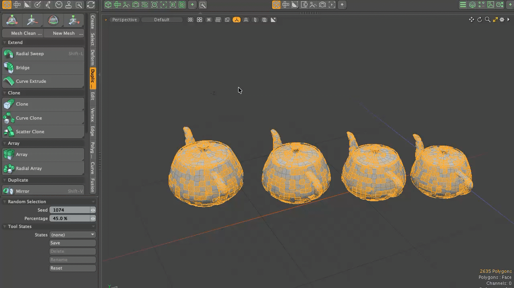

# Conditional Selection tools for Modo plug-in

<b>Conditional Selection Tools</b> are a collection of tools for selecting mesh elements based on specified conditions. The available tools are as follows:

1. <b>Select Edges By Length</b>: 
This tool selects edges based on a specified length, edges that match that length, or edges that are longer or shorter than that length. If an edge is selected before launching the tool, its length is used as the initial value for the <b>Length</b> parameter. 
2. <b>Select Edges By Normal</b>: 
This tool selects edges based on the average vector of the surface normals of the polygons sharing the edge. The reference edge used is the last one selected before launching the tool. For edges shared by a single polygon, the determination is made according to the method specified in <b>Open Edge</b>. If <b>Polygon Normal</b> is selected, the normal vector of the polygon sharing the edge serves as the reference vector. For <b>Out Vector</b>, the cross product of the polygon's normal vector and the vector connecting the edge's start and end points is used as the reference vector. 
3. <b>Select Edges By Angle</b>: 
This tool selects edges based on the angle between the polygons sharing the edge, calculated from the dot product of their normal vectors. If an edge is selected before launching the tool, the angle between the polygons sharing that edge is used as the initial value for the <b>Angle</b> setting. 
4. <b>Select Polygons By Area</b>: 
This tool selects polygons based on a specified area, polygons that match that area, or polygons with an area larger or smaller than the specified value. If a polygon is selected before launching the tool, its area is used as the initial value for the <b>Area</b> setting. 
5. <b>Random Selection</b>: 
This tool randomly selects mesh elements (vertices, edges, or polygons). The <b>Seed</b> value determines the random number generation; changing this value alters the random pattern. Each element is assigned a random weight value between 0.0 and 1.0. Elements with a weight value lower than the specified <b>Percentage</b> are selected. 

This kit contains a direct modeling tool for Modo macOS and Windows.

## Installing

- Download lpk from releases. Drag and drop it into your Modo viewport. If you're upgrading, delete previous version.

## How to use Conditional Selection

- Conditional Selection can be launched from **Conditional Selection** button on **Select** tab of **Model** ToolBar on left. The popup panel contains the buttons to launch each tools.

