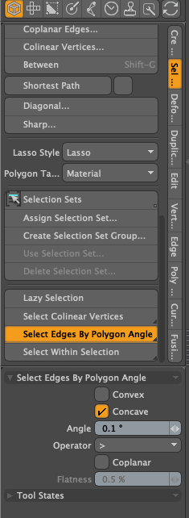

# Select Edges By Polygon Angle tool for Modo plug-in

Select Edges By Polygon Angle is a tool that selects edges based on the angle of the normal vectors of two shared polygons.  

Convex selects convex edges with the specified conditions. <b>Angle</b> is the angle of the shared polygon; edges that satisfy the comparison conditions specified in the <b>Operator</b> are selected. 

<b>Coplanar</b> selects edges where two shared polygons lie on the same plane. Flatness is the threshold for the plane ratio used to determine coplanarity. This operator is compatible with Modo's native coplanar algorithm. 

Hauling LMB on 3D view adjusts Angle value. 

This kit contains a direct modeling tool for Modo macOS and Windows.

## Installing

- Download lpk from releases. Drag and drop it into your Modo viewport. If you're upgrading, delete previous version.

## How to use Select Edges By Polygon Angle tool

- The tool version of Select Edges By Polygon Angle can be launched from **Select Edges By Polygon Angle** button on **Select** tab of **Model** ToolBar on left.

## Basic Usage with Select Edges By Polygon Angle tool

- Activate **Select Edges By Polygon Angle** button on **Select** tab of **Model** Modo toolbar.
- Lasso elements within selections on 3D view.

